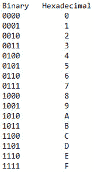
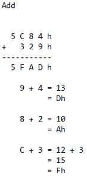
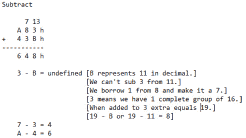

# 第 6 部分:十六进制数字系统

> 原文：<https://0xinfection.github.io/reversing/pages/part-6-hexadecimal-number-system.html>

如需所有课程的完整目录，请点击下方，因为除了课程涵盖的主题之外，它还会为您提供每个课程的简介。[https://github . com/mytechnotalent/逆向工程-教程](https://github.com/mytechnotalent/Reverse-Engineering-Tutorial)

既然我们是二进制大师，是时候解决编号系统的编号系统了！

我们在二进制中了解到每个数字代表一位。如果我们组合 8 位，我们得到一个字节。一个字节可以进一步细分为高 4 位和低 4 位。4 位的组合是一个半字节。由于 4 位的取值范围是 0 - 15，所以 16 进制更容易使用。请记住，当我们说基数为 16 时，我们从 0 开始，因此 0 - 15 是 16 个不同的数字。

这个令人兴奋的数字系统叫做十六进制。我们使用这个数字系统的原因是，在 x86 汇编中，用十六进制表示二进制数字比用其他任何数字系统都要容易得多。

十六进制与其他数字系统相似，除了十六进制以外，每一列的值是其右侧列值的 16 倍。十六进制的有趣之处在于，我们不仅有 0，1，2，3，4，5，6，7，8，9，我们还有 A，B，C，D，E 和 F，因此有 16 个不同的符号。

让我们看一个简单的表格，看看十六进制和十进制是如何比较的。

好吧，我看到你的耳朵冒烟了，但没关系！在十进制中，一切都以 10 的幂来处理。让我们用十进制来分析数字 42:

2 x 10 ^ 0 = 2

4 x 10 ^ 1 = 40

记住 10 的 0 次方是 1，10 的 1 次方是 10，因此，2 + 40 = 42。

拿起你的咖啡，有趣的东西来了！

如果我们知道十进制是一个以 10 为基数的数字系统，我们可以创建一个简单的公式，其中 b 代表基数。在这种情况下，b = 10。

(2 * b ^ 0) + (4 * b ^ 1)

(2 * 10 ^ 0) + (4 * 10 ^ 1) = 42

在二进制中，42 十进制是 0010 1010 二进制，如下所示:

0 x 2 ^ 0 = 0

1 x 2 ^ 1 = 2

0 x 2 ^ 2 = 0

1 x 2 ^ 3 = 8

0 x 2 ^ 4 = 0

1 x 2 ^ 5 = 32

0 x 2 ^ 6 = 0

0 x 2 ^ 7 = 0

0 + 2 + 0 + 8 + 0 + 32 + 0 + 0 = 42 十进制

在十六进制中，一切都以 16 的幂来处理。因此十进制的 42 是十六进制的 2A:

10 * 16 ^ 0 = 10

2 * 16 ^ 1 = 32

10 + 32 = 42 十进制 = > 2A 十六进制

这等同于说:

10 * 1 = 10

2 * 16 = 32

10 + 32 = 42 十进制 = > 2A 十六进制

请记住，十进制数 10 等于十六进制数，十进制数 2 等于十六进制数 2。在上面的公式中，当我们处理 A、B、C、D、E 或 F 时，我们需要将它们转换成十进制的等效值。

让我们再举一个 F5 十六进制的例子。这将如下:

5 x 16 ^ 0 = 5

15 x 16 ^ 1 = 240

5 + 240 = 245 个小数位数 = > 十六进制 F5

让我们看一个二进制到十六进制的表格:

理解每个十六进制数都是 4 位长或称为半字节是很重要的。当我们将 C 程序逆向工程成汇编时，这将变得至关重要。

让我们从另一个角度来看这个问题。让我们处理更多的十六进制数字，并将它们转换成十进制:

要再次强调 F1CD 是一个简单的转换:

D - 13 x 1 = 13

C - 12 x 16 = 192

1 - 1 x 256 = 256

f-15 x 4096 = 61 440

13 + 192 + 256 + 61,440 = 61,901

十六进制加法的工作原理如下。从这一点开始，所有十六进制数字的旁边都将有一个“h ”:

另一个例子是这样的:

最后一个添加示例如下:

我们现在将关注减法:

你可能会问自己，为什么这个家伙要花这么多时间去研究这么多不同的学习方法！答案是，我们每个人学到的东西都有所不同。我想展示十六进制与十进制和二进制相比的几种表示法，以帮助组合整个画面。

最基本的是，你要了解这里发生了什么，才能继续前进。如果您有任何问题，请在下面评论，我将非常乐意帮助您！

在下一课中，我们将讨论开关、晶体管和存储器。