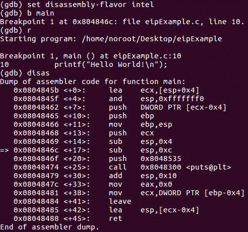

# 第 12 部分:指令指针寄存器

> 原文:[https://0x infection . github . io/reversing/pages/part-12-instruction-pointer-register . html](https://0xinfection.github.io/reversing/pages/part-12-instruction-pointer-register.html)

如需所有课程的完整目录，请点击下方，因为除了课程涵盖的主题之外，它还会为您提供每个课程的简介。[https://github . com/mytechnotalent/逆向工程-教程](https://github.com/mytechnotalent/Reverse-Engineering-Tutorial)

被称为 EIP 寄存器的指令指针寄存器是任何逆向工程中最重要的寄存器。EIP 跟踪下一个要执行的指令代码。EIP 指向下一条要执行的指令。如果你改变指针跳转到代码中的另一个区域，你就完全控制了那个程序。

让我们向前跳，深入一些代码。这是一个简单的 C 语言 hello world 应用程序的例子，我们将在后面的系列教程中详细介绍。就我们今天的目的而言，我们将看到汇编语言的原始能力，特别是 EIP 寄存器的能力，以及我们能做些什么来完全破解程序控制。

如果您不理解它的作用或功能，请不要担心。这里需要注意的是，我们有一个名为 unreachableFunction 的函数，它从未被 main 函数调用过。正如你将看到的，如果我们能控制 EIP 寄存器，我们就能黑掉这个程序来执行代码！

我们简单地编译了代码，以便与 IA32 指令集一起工作并运行它。如你所见，没有对任何类型的**不可达函数**的调用，因为在正常情况下它是不可达的，就像你看到的 Hello World！执行时打印。

我们已经用 GDB 调试器反汇编了程序。我们已经在主函数上设置了一个断点并运行了程序。= >显示了当我们进入下一条指令时，EIP 指向的位置。如果我们遵循正常的程序流程，‘你好，世界！将打印到控制台并退出。

如果我们再次运行这个程序，检查 EIP 指向哪里，我们会看到:

我们可以看到 EIP 指向 main+17 或地址 0x680cec83。

让我们检查一下**不可达函数**，看看它在内存中的起始位置，并记下那个地址。

下一步是将 EIP 设置为地址 0x0804843b，以便我们劫持程序流来运行不可访问的函数。

现在我们已经黑掉了 EIP 的控制权，让我们继续，看看我们是如何劫持一个正在运行的程序的操作来为我们所用的！

Tada！我们已经破解了程序！

所以你心中的问题是，当我完全不知道这是什么的时候，你为什么要给我看这个？重要的是要明白，当我们在做一个像这样的冗长的教程时，我们有时应该在深入学习之前，看看为什么我们要采取这么多步骤来学习基础知识。然而，重要的是向您展示，如果您坚持学习本教程，您的辛勤工作将会得到回报，因为我们将学习如何劫持任何正在运行的程序，使它做我们想做的任何事情，此外还主动分解恶意程序，这样我们不仅可以禁用它，还可以追溯到黑客发起的潜在 IP。

在下一篇教程中，我们将继续讨论带控制寄存器的 IA-32 架构。