# 第 17 部分——如何安装 Linux

> 原文：<https://0xinfection.github.io/reversing/pages/part-17-how-to-install-linux.html>

如需所有课程的完整目录，请点击下方，因为除了课程涵盖的主题之外，它还会为您提供每个课程的简介。[https://github . com/mytechnotalent/逆向工程-教程](https://github.com/mytechnotalent/Reverse-Engineering-Tutorial)

如果你家里的电脑上没有安装 Linux，我建议你安装 Virtual Box，这是一个开源的免费虚拟环境，你可以把它安装在你现有的电脑上，这样你就有了一个可以用来编程的 Linux 版本。下面是下载和安装 Virtual Box 的链接，因为它有 Windows 和 Mac 两个版本。

[https://www.virtualbox.org/wiki/Downloads](https://www.virtualbox.org/wiki/Downloads )

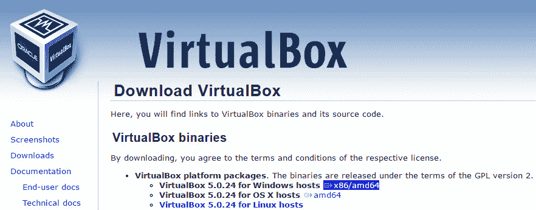

此外，你需要一份我将使用 Ubuntu 的 Linux。下面是下载的链接。安装 Virtual Box 后将安装到的 iso 文件。

[http://www.ubuntu.com/download/desktop](http://www.ubuntu.com/download/desktop)

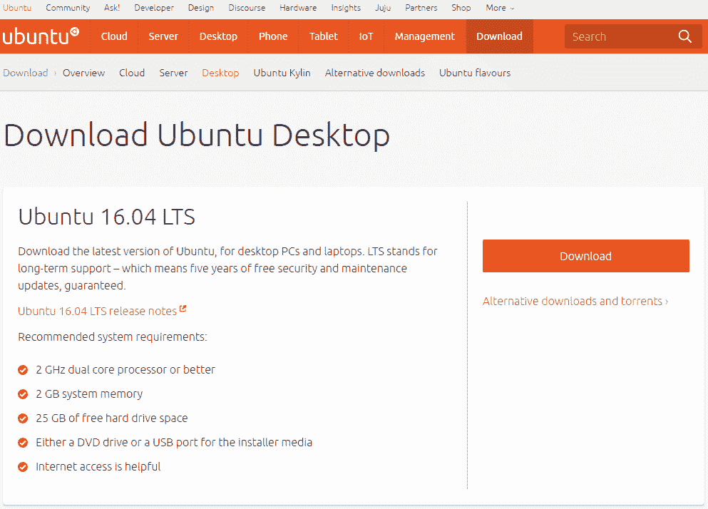

你下载完上面的**。iso** ，进入你的**下载**目录，首先执行并运行**VirtualBox-5.0.24-108355-Win.exe**或任何当前可用的 VirtualBox 版本。如果你运行的是 Mac，你会下载**。dmg** 文件。只需双击文件来执行和运行它。

在你安装了**VirtualBox-5.0.24-108355-Win.exe**或者 Mac **之后。dmg** 文件，您将看到这个屏幕:

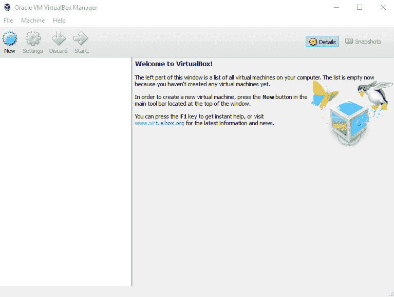

点击上面的新按钮，它位于屏幕的左上角，因为它是一个蓝色的齿轮状的大圆圈。

在上面的名称字段中，键入 Ubuntu，然后单击下一步按钮。

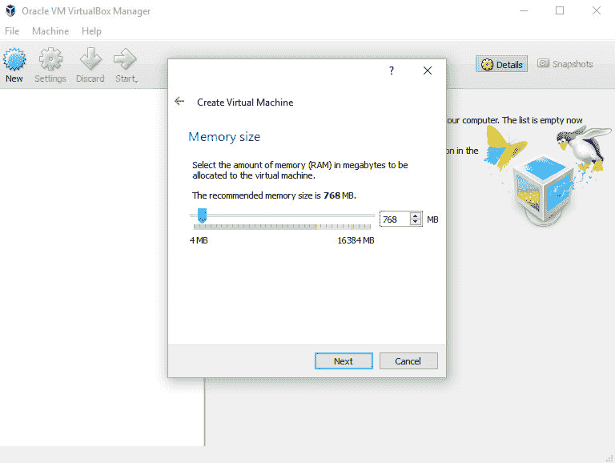

重要的是点击上面的蓝色滑动条，选择指向绿色区域的内存量，这样它就不会淹没你的计算机资源。移动蓝色滑块后，单击下一步。

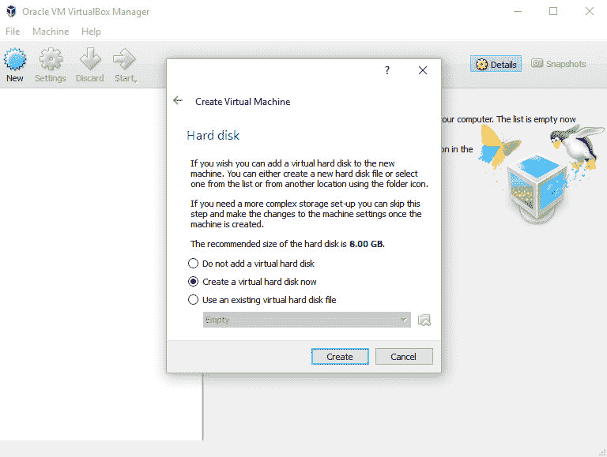

然后单击创建。

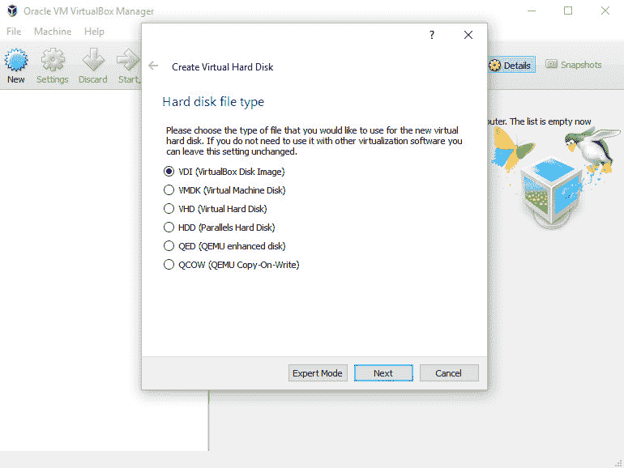

然后单击下一步。

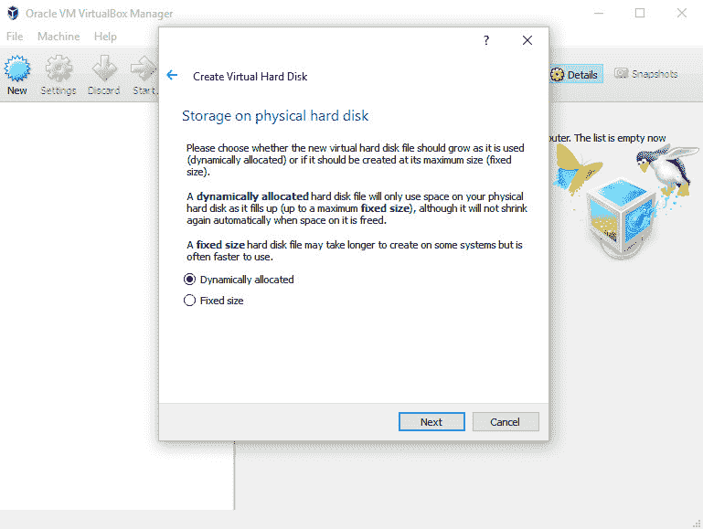

然后单击下一步。

请将刻度盘移动到 16.00 GB，而不是上面显示的 8.00 GB，然后单击“创建”。

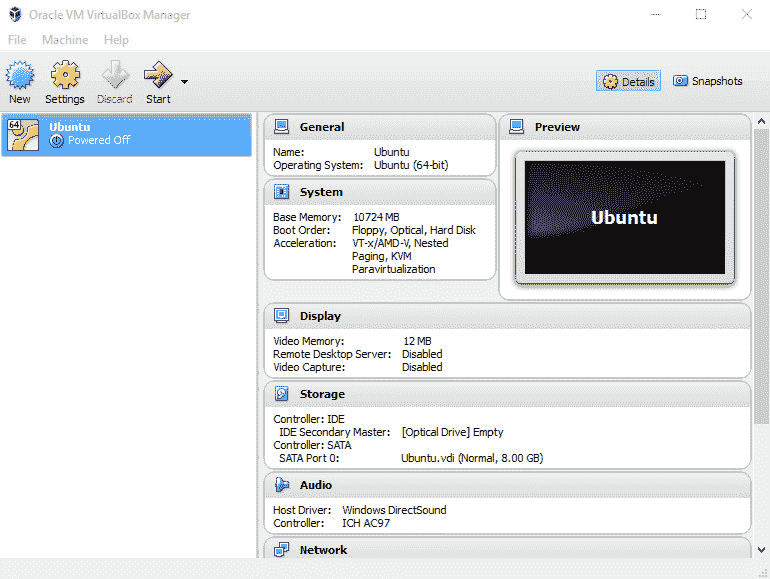

下一步是点击绿色的开始按钮。

下一步是单击 cancel 按钮上方的黄色文件夹。

下一步是单击。iso 文件，它应该在您的下载目录中，然后单击打开。

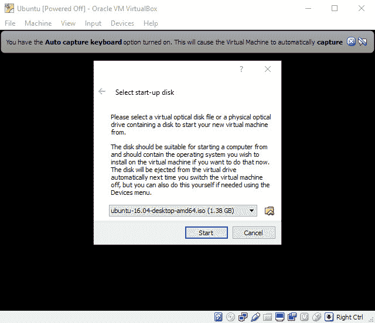

下一步是单击开始。

下一步是让安装开始，并点击安装 Ubuntu。

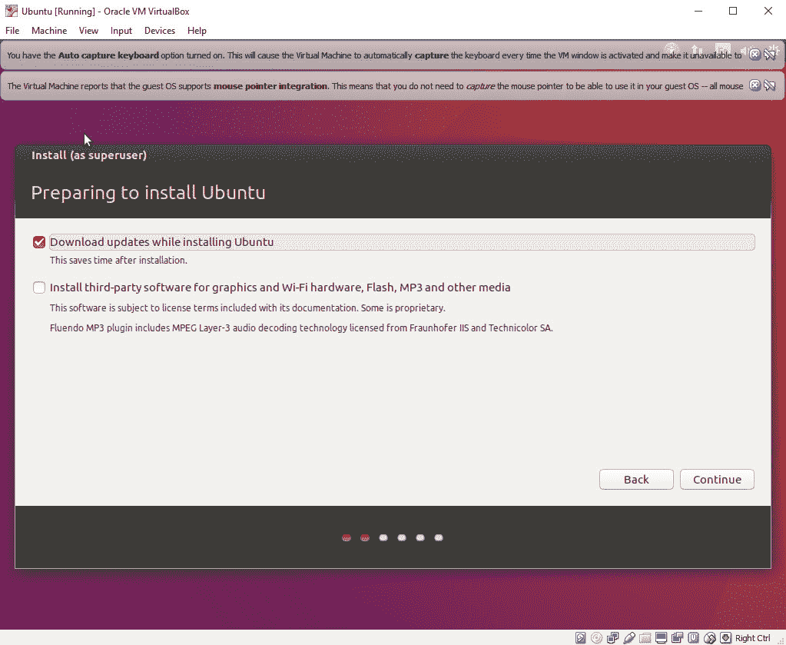

下一步是在安装 Ubuntu 时勾选每个下载更新的复选框，然后点击继续。

下一步是选择擦除磁盘并安装 Ubuntu，然后点击立即安装。

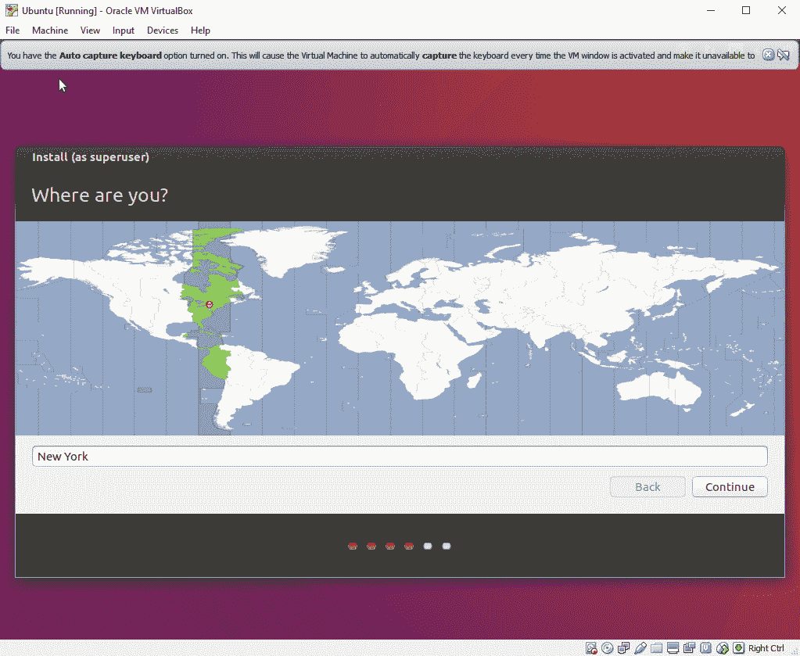

下一步是单击 continue，前进到您将选择时区的屏幕，您将选择 continue。

下一步是选择您的键盘布局，然后单击继续。

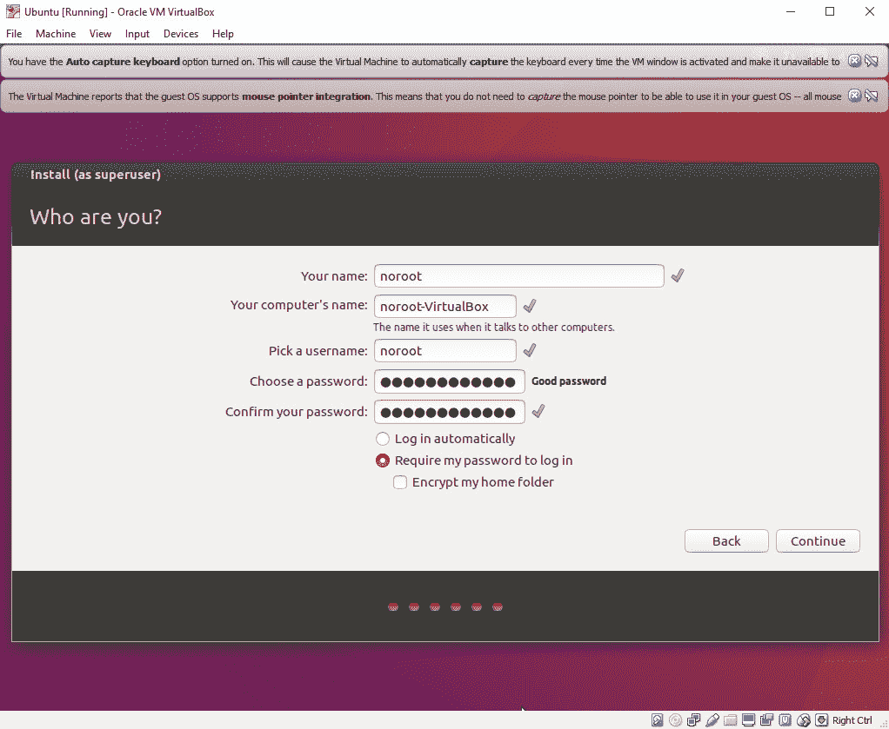

下一步是为您的帐户创建一个名称。我选择了 noroot，并对用户名做了同样的操作。此外，创建一个密码并重新输入以供验证，然后单击继续。

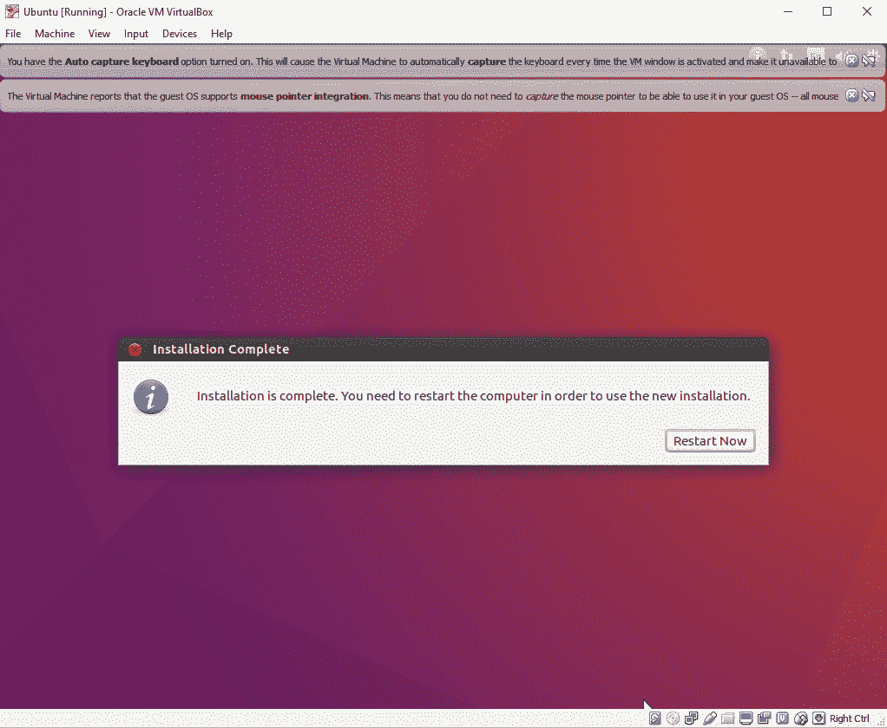

此时，安装操作系统需要一些时间。该过程完成后，单击立即重新启动。如果窗口锁定，单击关闭机器，然后单击关闭或下一步。

此时，单击绿色的开始按钮。

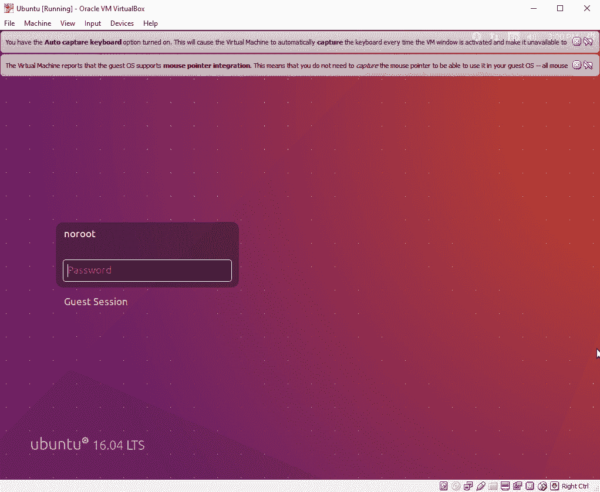

输入您之前创建的密码，然后单击键盘上的 Enter。您可以单击右上角的蓝色 x 按钮，因为它们只是一些您可以关闭的信息。

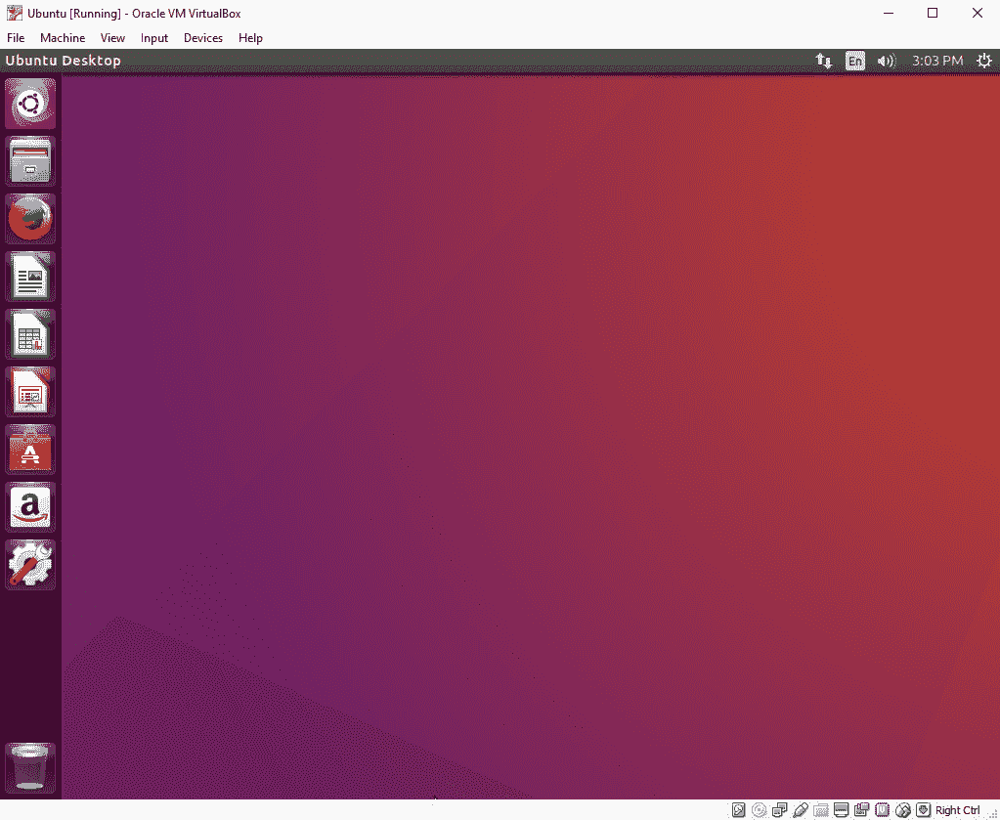

恭喜你！你有一个工作版本的 Linux！

单击左上方的图标并键入 terminal，然后双击窗口中带有> _ 的第一个终端图标。

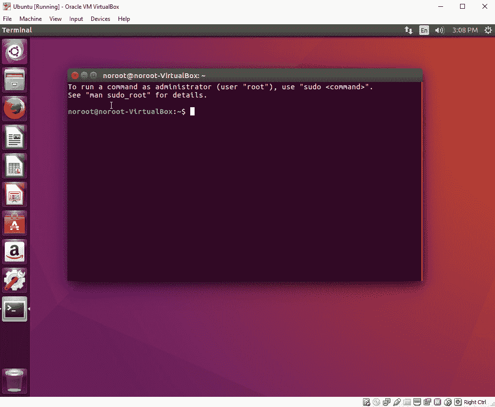

您会在屏幕的左下角看到一个终端图标。右键单击它，并选择锁定到启动器，这样一旦你关闭窗口，它将为你所用。

在终端窗口中键入 cd Desktop，然后按 Enter 键。然后键入 mkdir 代码并按回车键。第一个命令将您移动到桌面目录，mkdir 命令在桌面上创建一个名为 Code 的文件夹，以便我们有一个地方来存储我们创建的软件应用程序。

保持你的 Linux 版本最新是很重要的。每次登录时，您都应该键入以下命令。首先，sudo apt-get 更新并按回车键。

接下来，您应该键入 sudo apt-get upgrade 并按 enter 键。

为了使用 32 位汇编检查，我们需要安装 gcc multilib 包，以便我们可以编译 32 位版本的 C 代码进行检查。键入 sudo apt-get install gcc-multilib，然后按 enter 键。

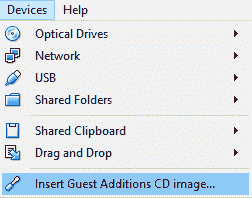

最后，点击**设备**并点击**插入来宾附加 CD 映像……**以获得虚拟机的更好工作功能。

这是一个很长的教程，但是对你获得一个 Linux 的工作副本是必要的，这样我们可以继续我们未来的教程。

我期待着下周在我们学习如何使用 vim 文本编辑器开始编码时见到大家！