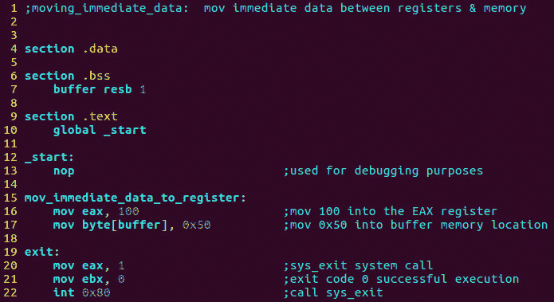
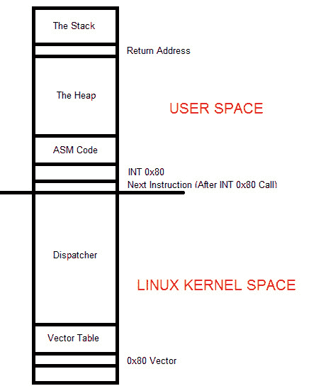

# 第 22 部分- ASM 程序 1[移动即时数据]

> 原文:[https://0x infection . github . io/reversing/pages/part-22-ASM-program-1-moving-immediate-data . html](https://0xinfection.github.io/reversing/pages/part-22-asm-program-1-moving-immediate-data.html)

如需所有课程的完整目录，请点击下方，因为除了课程涵盖的主题之外，它还会为您提供每个课程的简介。[https://github . com/mytechnotalent/逆向工程-教程](https://github.com/mytechnotalent/Reverse-Engineering-Tutorial)

我感谢大家的耐心，因为我们花了 21 课才完成了我们的第一个 ASM 程序，然而，为了充分理解我们在开发汇编语言时从哪里开始，必须涵盖非常必要的背景知识。

我们将创建 32 位汇编程序，因为大多数恶意软件是以 32 位模式编写的，以便攻击尽可能多的系统。请记住，即使我们大多数人都有 64 位操作系统，32 位程序也可以在其上运行。

在汇编语言方面，我们大部分时间都在使用英特尔语法，但我将重点关注未来的原生美国电话电报公司语法。正如我在之前的教程中演示的那样，在英特尔和美国电话电报公司语法之间来回转换非常容易。

每个汇编语言程序都分为三个部分:

1) **数据段**:该段用于声明初始化数据或常量，因为这些数据在运行时不会改变。您可以声明常量值、缓冲区大小、文件名等。

2) **BSS 段**:该段用于声明未初始化的数据或变量。

3) **文本部分**:这个部分用于实际的代码部分，因为它以一个 global _start 开始，告诉内核执行从哪里开始。

任何开发的关键是注释的使用。在美国电话电报公司语法中，我们使用#符号来声明一个注释，因为编译器会忽略每一行中该符号之后的任何数据。

请记住，汇编语言语句每行输入一个语句，因为您不必像许多其他语言那样以分号结束一行。语句的结构如下:

**【标签】助记符【操作数】【注释】**

一条基本指令有两部分，第一部分是指令名或被执行的助记符，第二部分是命令的操作数或参数。

我们的第一个程序将演示如何将立即数据移动到寄存器和立即数据移动到内存。

让我们打开 VIM，创建一个名为 **moving_immediate_data.s** 的程序，并键入以下内容:

要编译，请键入:

**as–32-o moving _ immediate _ data . o moving _ immediate _ data . s**

**LD-m elf _ i386-o moving _ immediate _ data moving _ immediate _ data . o**

要运行，请键入:

**。/moving_immediate_data**

我想向您展示它在英特尔语法中的样子。在我们检查这一部分之前，您需要在命令提示符下键入 **sudo apt-get install nasm** ，这将安装全网汇编程序:

要编译，请键入:

**nasm-f elf 32 moving _ immediate _ data . ASM**

**LD-m elf _ i386-o moving _ immediate _ data moving _ immediate _ data . o**

要运行，请键入:

**。/moving_immediate_data**

好吧，管它呢！没有输出！这是正确的，你没有做错任何事情。我们的许多程序实际上不会做任何事情，因为它们只不过是我们将在 GDB 用于分析和操作的沙盒程序。

下周我们将深入 GNU GDB 调试器，看看到底发生了什么。

我想花点时间讨论一下美国电话电报公司版本和英特尔语法版本中第 20–22 行的代码。这组指令利用了我们所说的软件中断。在美国电话电报公司语法的第 20 行，我们 **movl $1，%eax** 意味着我们将十进制值 1 移动到 eax 中，eax 指定 sys_exit 调用，该调用将正确地终止程序执行返回到 Linux，这样就不会出现分段错误。在第 21 行，我们 **movl $0，%ebx** ，它将 0 移入 ebx 以显示程序成功执行，最后我们看到 int **$0x80** 。

第 20 行和第 21 行设置了软件中断，我们在第 22 行用指令 int **$0x80 调用它。**让我们更深入地探讨一下这个问题。

在 Linux 中，有两个不同的内存区域。在任何程序执行的最底层，我们都有内核空间，它由调度程序部分和向量表组成。

在任何程序执行中，内存的最顶端都有用户空间，它由堆栈、堆以及最终的代码组成，所有这些都可以在下图中进行说明:

当我们像上面演示的那样加载值并调用 INT 0x80 时，用户空间中的下一条指令的地址，也就是您的代码 ASM 代码段，被放入堆栈中的返回地址区域。这是至关重要的，以便当 INT 0x80 执行其工作时，它可以正确地知道接下来要执行什么指令，以确保正确和顺序的程序执行。

请记住，在现代版本的 Linux 中，我们使用的是保护模式，这意味着您无法访问 Linux 内核空间。上图中间那条长线下面的所有东西都代表 Linux 内核空间。

自然的问题是为什么我们不能访问这个？答案很简单，Linux 不允许你的代码访问操作系统内部，因为这将是非常危险的，因为任何恶意软件都可以操纵操作系统的这些组件来跟踪各种各样的事情，如用户按键、活动等。

此外，除了系统补丁和升级之外，随着新软件的安装和删除，现代 Linux OS 体系结构会不断地改变这些关键组件的地址。这是保护模式操作系统的基础。

我们让代码与 Linux 内核通信的方式是通过使用内核服务调用门，它是运行程序的用户空间和内核空间之间的受保护网关，内核空间是通过 0x80 的 Linux 软件中断实现的。

在内存的最底部，即段 0、偏移量 0 所在的位置，有一个包含 256 个条目的查找表。每个条目是包括段和偏移部分的存储器地址，每个条目由 4 个字节组成，因为第一个 1024 字节是为该表保留的，并且在那里不能操纵其他代码。每个地址称为一个中断向量，它包括称为中断向量表的整体，其中每个向量都有一个从 0 到 255 的数字，向量 0 从 0 开始占用字节 0 到 3。这继续到包含 4 到 7 的向量 1，等等。

请记住，这些地址都不是永久记忆的一部分。静态的是指向服务调度程序的向量 0x80，服务调度程序指向 Linux 内核服务例程。

当返回地址从堆栈中弹出时，返回到下一条指令，这条指令被称为中断返回或 IRET，它完成了程序流的执行。

花些时间打开终端，输入以下命令，查看整个系统调用表:

**cat/usr/include/ASM/unistd _ 32 . h**

下面是其中一些的快照。如您所见，exit 1 代表我们在上面的代码中使用的 sys_exit。

从本课开始，我们将采用 3 步走的方法:

1) **程序**

2) **调试**

3) **黑掉**

每周我们将从一个程序开始，就像你在这里看到的一样，接下来的一周我们将把它带到 GDB，并检查在组装级别上到底发生了什么，最后在每周的第三个系列中，我们将在 GDB 黑客攻击数据，将其更改为我们想要的任何内容，展示控制程序流的能力，包括学习如何将恶意软件攻击到不构成威胁的程度。

我们不一定会直接看恶意软件，因为我更愿意关注汇编语言程序的主题，它将为您提供工具和理解，以便任何程序都可以根据您的喜好进行调试和操作。这就是这些教程的目的。

您将在本系列教程中学习的信息也可以用于高级 GUI 调试器，如 IDA Pro，但是我将只关注 GNU GDB 调试器。

我期待着下周当我们开始创建我们的第一个汇编调试时与大家见面！