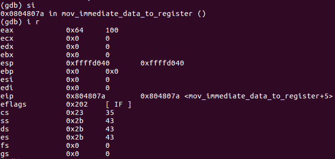
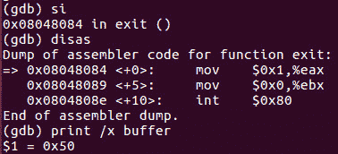

# 第 23 部分- ASM 调试 1[移动即时数据]

> 原文：<https://0xinfection.github.io/reversing/pages/part-23-asm-debugging-1-moving-immediate-data.html>

如需所有课程的完整目录，请点击下方，因为除了课程涵盖的主题之外，它还会为您提供每个课程的简介。[https://github . com/mytechnotalent/逆向工程-教程](https://github.com/mytechnotalent/Reverse-Engineering-Tutorial)

让我们从将二进制文件加载到 GDB 开始。

要加载到 GDB，请键入:

**GD b-q moving _ immediate _ dat**

让我们首先通过键入 b _start 在 start 上设置一个断点。

然后我们可以通过输入 **r** 来运行程序。

为了开始反汇编，我们只需输入 **disas** 。

我们编写了一个 **nop** ，从操作码的角度来看，这意味着没有操作，或者 0x90，用于断点正确命中的正确调试目的。这是创建汇编程序时的一个好习惯。

正如我以前多次说过的，本地语法是你在上面看到的美国电话电报公司语法。我故意痛苦地来回走，以便你在每一个方面都感到舒适，但是向前看，我将坚持美国电话电报公司语法，但是我想给你看两者的几个例子。我要再次声明，如果你想看英特尔语法，只需输入 set-disassembly-flavor intel，你就会得到你想要的。

我们首先使用命令 si，它意味着进入下一条指令。我们在这里看到的是在 **_start+0** 处，你将 **0x64** 的十六进制值移入 **EAX** 。这只是将十进制数 **100** 或计算机认为的十六进制数 **0x64** 移入 **EAX** 中，演示了将立即值移入寄存器。

我们再次进入，然后使用命令 i r，记住它们之间有一个空格，给我们关于 CPU 寄存器状态的信息。我们可以看到 EAX 现在的值是 0x64 十六进制或 100 十进制。

在我们再次进入并执行了 **disas** 之后，我们看到我们已经将 **0x50** 的值移动到了**缓冲区**标签中，这可以参考上周的源代码来查看。

当处理非寄存器数据时，我们可以使用上面的 print 命令，因为我们键入了 **print /x buffer** ，它清楚地告诉我们 buffer 内的值是 **0x50** 。 **/x** 标志表示以十六进制显示数值。

因此，您可以查看上面本教程的第 2 张幻灯片，在 **_start+5** 处，您会看到加载到**缓冲区**标签中的 **0x50** 的立即值，或者在本例中是**缓冲区**的地址 **0x8049090** ，我们可以通过键入 **x/xb 0x8049090** 使用检查指令来检查它，这向我们显示了在该位置产生**的一个十六进制字节**

我们将对每个程序示例都这样做，以便我们可以深入调试过程。如果有任何问题，请在下面的评论中留下。

我期待着下周当我们开始创建我们的第一个汇编代码时与大家见面！