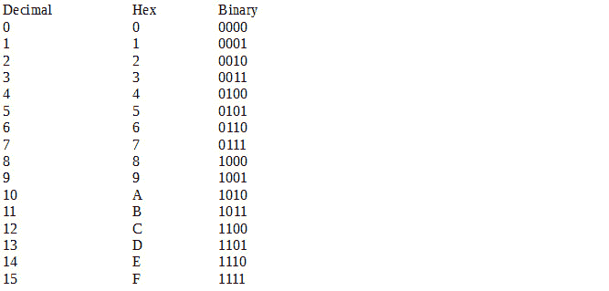

# 第 2 部分–数字系统

> 原文：<https://0xinfection.github.io/reversing/pages/part-2-number-systems.html>

如需所有课程的完整目录，请点击下方，因为除了课程涵盖的主题之外，它还会为您提供每个课程的简介。[https://github . com/mytechnotalent/逆向工程-教程](https://github.com/mytechnotalent/Reverse-Engineering-Tutorial)

微处理器的核心是一系列二进制数，它们是+5V(开或 1)或 0V(关或 0)。每个 0 或 1 代表微处理器中的一位信息。8 位的组合形成一个字节。

在我们深入研究二进制之前，让我们先来看看熟悉的十进制。如果我们取 2017 这个数字，我们会理解为 2017 年。

让我们来看看二进制系统和它如何运行的基础知识。

如果我们要把一个二进制数转换成十进制数，我们只需简单地做以下事情。让我们取一个二进制数 0101101，如你所见，它是十进制的 93。

将“值”列中的值相加得到十进制数 0 + 64 + 0 + 16 + 8 + 4 + 0 + 1 = 93。

如果我们要将一个十进制数转换成二进制数，我们将检查是否可以相对于最高位进行减法运算，如果可以，则将 1 放入二进制列，余数将被带入下一行。让我们考虑十进制值 120 的例子，它是 0111 1000 二进制。

1)128 能放在 120 里面吗:不能，所以是 0。

2)120 里面能装下 64 吗:能，所以 1，那么 120–64 = 56。

3)32 能装进 56 吗:是的，所以是 1，那么 56–32 = 24。

4)16 能装进 24 吗:是的，所以是 1，那么 24–16 = 8。

5)8 能装进 8 吗:是的，所以是 1，那么 8–8 = 0。

6)4 能放在 0 里面吗:不能，所以 0。

7)2 能放在 0 里面吗:不能，所以 0。

8)1 能放在 0 里面吗:不能，所以 0。

当我们想将二进制转换为十六进制时，我们只需使用下表。

让我们将二进制数(如 0101 111)转换成十六进制数。要做到这一点，我们只需查看表格并比较由 4 位组合而成的每个半字节。请记住，8 位等于一个字节，2 个半字节等于一个字节。

0101 = 5

1111 = F

因此 0101 1111 二进制= 0x5f 十六进制。0x 符号表示十六进制。

从十六进制到二进制非常简单，因为你只需做相反的事情，比如:

0x3a = 0011 1010

3 = 0011

A = 1010

理解每个十六进制数字的长度是一个半字节很重要，因此两个十六进制数字的长度是一个字节。

要将十六进制转换为十进制，我们需要执行以下操作:

0x5f = 95

5 = 5 x 16^1 = 5 x 16 = 80

F = 15 x 16^0 = 15 x 1 = 15

因此，我们可以看到，80 + 15 = 95 是 0x5f 十六进制。

最后将十进制转换成十六进制。让我们取十进制数 850，也就是十六进制数 352。

我们从下到上把数字放在一起，得到 352 个十六进制数。

“当计算机为我做这些的时候，我为什么要浪费时间去学这些垃圾！”

如果你碰巧认识任何逆向工程师，请你花一点时间问他们上述问题。

实际情况是，如果您对上述所有内容的工作原理没有非常透彻的理解，您将很难理解 ARM 处理器寄存器是如何保存和操作数据的。你也将很难理解 ARM 处理器如何处理二进制溢出，以及它对进位操作的影响，你也不会理解比较操作是如何工作的，甚至是最简单的汇编代码的最基本操作。

我不是建议你记住上面的内容，也不是建议你每个都做一千个例子。我所要求的是，你要花时间真正理解字面上的一切，我的意思是一切都归结于处理器中的二进制位。

无论你是创建、调试还是破解一个汇编、Python、Java、C、C++、R、JavaScript 或任何其他流行的新语言应用程序，最终一切都必须归结为二进制 0 和 1，它们代表+5V 或 0V。

我们人类使用十进制系统。该处理器在 16 进制系统上工作。我们结合 Linux 处理的寄存器是以 32 位大小寻址的。当我们开始讨论处理器寄存器时，我们将了解到每个寄存器都是 32 位宽(从技术上来说，BCM2837 是 64 位宽，但是我们使用的 Linux 版本是 32 位，因此我们只对每个寄存器的 32 位进行寻址)。

下周我们将深入学习二进制加法！敬请期待！