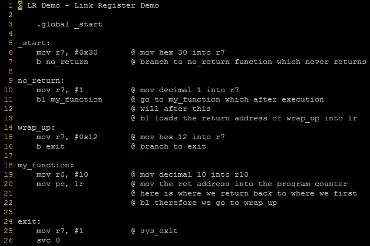
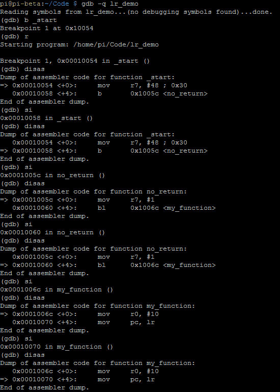

# 第 9 部分-链接寄存器

> 原文:[https://0x infection . github . io/reversing/pages/part-9-link-register . html](https://0xinfection.github.io/reversing/pages/part-9-link-register.html)

如需所有课程的完整目录，请点击下方，因为除了课程涵盖的主题之外，它还会为您提供每个课程的简介。[https://github . com/mytechnotalent/逆向工程-教程](https://github.com/mytechnotalent/Reverse-Engineering-Tutorial)

链接寄存器 R14 用于保存函数调用的返回地址。

当 BL(带链接的分支)指令执行子例程调用时，链接寄存器被设置为子例程返回地址。BL 跳转到代码中的另一个位置，并在完成时允许返回到 BL 代码段之后的点。当子例程返回时，链接寄存器将地址返回给程序计数器。

链接寄存器不需要对包含堆栈的存储器进行写入和读取，这可以通过重复调用小的子例程来节省相当大比例的执行时间。

当 BL 已经执行时，返回地址，即要执行的下一条指令的地址，被加载到 LR 或 R14 中。子程序完成后，LR 被直接复制到 PC(程序计数器)或 R15，代码继续在顺序代码源中先前的位置执行。

代码时间！如果您不理解这里的代码示例中的所有内容，也不要气馁。在接下来的几课中，这一点会变得很清楚。



要编译:

```
as -o lr_demo.o lr_demo.s

ld -o lr_demo lr_demo.o

```

我在这里创建的简单示例非常简单明了。我们开始并前进到 **no_return** 子程序，前进到 **my_function** 子程序，然后到 **wrap_up** 子程序，最后**退出**。



我们有必要进入 GDB，它是我们的调试器，看看每一步到底发生了什么:

正如你所看到的，调试器中的每一步都准确地显示了从 **no_return** 到 **my_function** 跳过 **wrap_up** 直到程序计数器从链接寄存器中获得地址的过程。


这里我们看到了从**结束**到**退出**的过程。

这是一个基本的操作，当我们下周看到堆栈如何操作时，因为 LR 是这个过程的重要部分。

下周我们将深入研究堆栈指针！敬请期待！