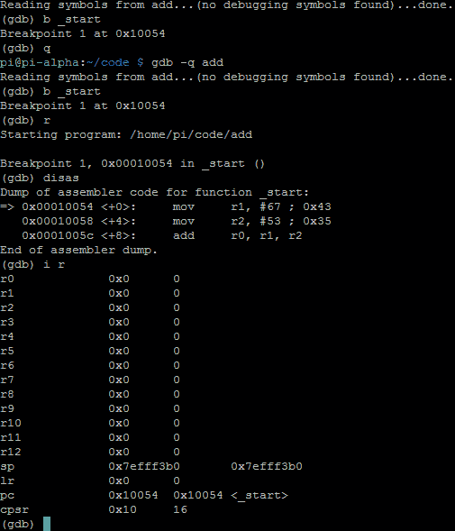
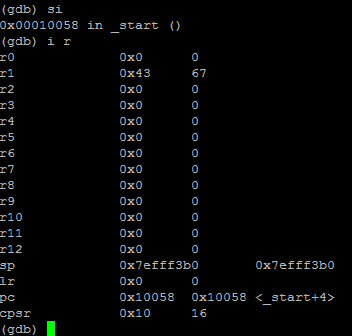
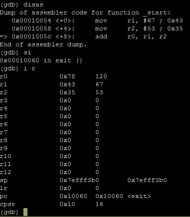

# 第 15 部分-调试添加

> 原文：<https://0xinfection.github.io/reversing/pages/part-15-debugging-add.html>

如需所有课程的完整目录，请点击下方，因为除了课程涵盖的主题之外，它还会为您提供每个课程的简介。[https://github . com/mytechnotalent/逆向工程-教程](https://github.com/mytechnotalent/Reverse-Engineering-Tutorial)

让我们回顾一下下面的添加示例:

我们再次看到，我们将十进制数 67 移入 **r1** ，并将十进制数 53 移入 **r2** 。然后我们**将 r1** 和 **r2** 相加，并将结果放入 **r0** 中。

我们来编译一下:

**as -o add.o add.s**

**ld -o add add.o**

让我们带进 GDB 调试:

**gdb -q 添加**

我们可以看到，当我们 b **_start** ，break on start 和 **r** ，run 我们看到了拆卸。如果你做了一个 **i r** ，我们会看到信息寄存器，我们注意到我们的 **cpsr** 是 **0x10** 。

当我们再次迈步时，信息记录:

我们注意到 **0x43** 十六进制或 **67** 十进制到 **r1** 。我们还注意到标志没有改变( **cpsr 0x10** )。

让我们再来一步，信息寄存器:

我们可以看到 **r0** 现在持有 **0x78** 十六进制或 **120** 十进制。我们成功地看到 add 指令就位，我们再次注意到 flags 寄存器( **cpsr** )保持不变。

下周我们将深入探讨如何破解 ADD。