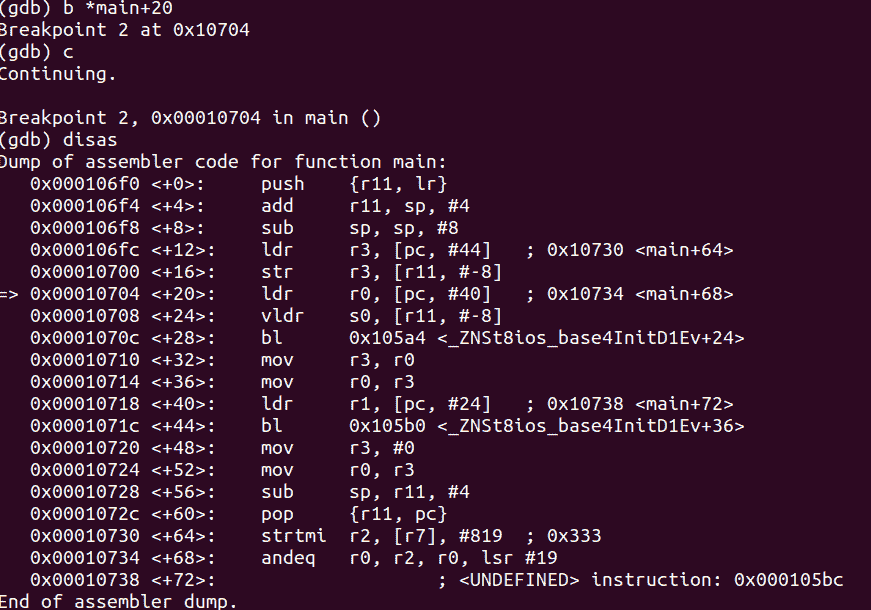
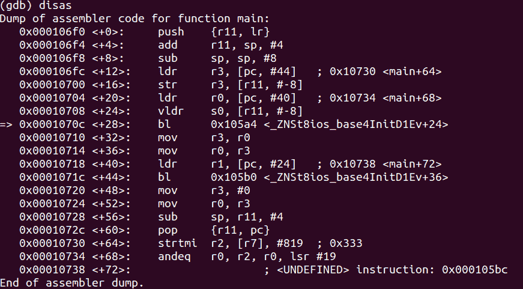

# 第 31 部分——破解浮点变量

> 原文:[https://0x infection . github . io/reversing/pages/part-31-hacking-float-variables . html](https://0xinfection.github.io/reversing/pages/part-31-hacking-float-variables.html)

如需所有课程的完整目录，请点击下方，因为除了课程涵盖的主题之外，它还会为您提供每个课程的简介。[https://github . com/mytechnotalent/逆向工程-教程](https://github.com/mytechnotalent/Reverse-Engineering-Tutorial)

让我们重新检查我们的代码。

```
#include <iostream>

int main(void) {

            int myNumber = 1337.1;

            std::cout << myNumber << std::endl;

            return 0;

}

```


让我们回顾一下上周的教程。


让我们打断一下 **main+20** 继续那个点。



我们来看看 **r11-8** 里面是什么值。我们清楚地看到它是 **1337.09998** ，接近我们在原始 c++代码中的值。请记住，浮点数的精度大约是 7 位小数，这就是为什么我们看不到 **1337.1** 的原因，所以请记住这一点。


我们也可以在高内存中看到这个值。


让我们在 **main+28** 上中断并继续。


我们看到一个奇怪的新指令。我们看到 **vldr** 和 **r11、#8** 内的值被移入 **s0** 。那么什么是 **s0** ？我们有一个数学协处理器，它有一系列处理十进制或浮点数的附加寄存器。这里我们看到一个这样的例子，其中 **1337.09998** 的值被移入 **s0** 。 **vldr** 指令将一个常数值加载到单精度或双精度寄存器的每个元素中，如 **s0** 。



只有当我们像下面这样执行 info registers all 命令时，我们才能看到这些特殊的寄存器。


下面我们看到该值现在被移入 **s0** 。


我们黑吧！


现在让我们看看登记簿，看看发生了什么。


如你所见，我们已经破解了这个值(减去精确到 6 位小数的浮点变量的精度问题)！


最后，当我们继续时，我们看到当 c++ **cout** 函数执行时，我们被攻击的值回显到终端。

下周我们将深入研究双变量。